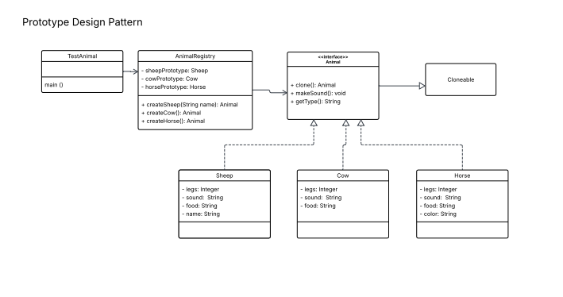

# Prototype Pattern Lab - Animal Cloning

A simple Java implementation of the Prototype Design Pattern using **Copy Constructors**.

## Files
* `Animal.java` - The base interface with a `clone()` method.
* `Sheep.java`, `Cow.java`, `Horse.java` - Concrete classes implementing copy constructors.
* `AnimalRegistry.java` - Pre-loads prototypes and handles the cloning process.
* `TestAnimal.java` - The main client class to test the pattern.

## UML Class Diagram
